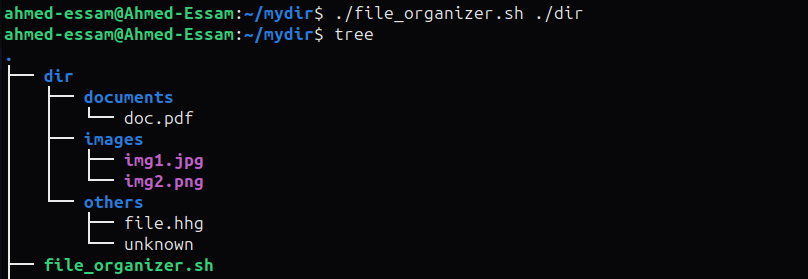

# Bash Script Task - File Organizer

It is required to organize a source directory files into sub-directories basecd on each file type such as:

* Creating an **images** directory with all image files (`.jpg`, `.png`, `.gif`).
* Creating a **documents** directory with all document files (`.txt`, `.doc`, `.pdf`).
* Creating an **others** directory with all other files (`unknown file types` or files `without extensions`).

## Example

### Putting a number of different files in a directory

* Here, we put two image files, one document file, an unknown file type, and a file without an extension.

### Running the bash script on the given directory

