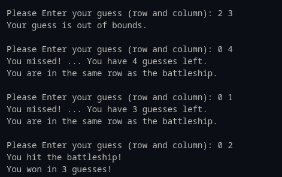

# Battleship

It is required to make a game of trying to hit a battleship residing in a random vertex in a 5x5 grid by asking the player to guess the position of the battleship in only 5 tries.

* If the player misses the battleship's row and column, the the number of guesses left is not affected (the guess is out of bound).

## Example Run

