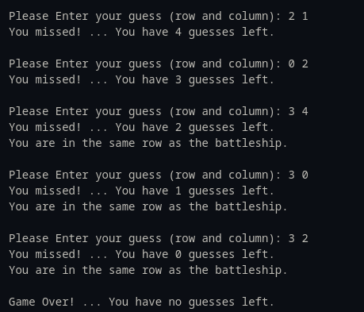

# Battleship

It is required to make a game of trying to hit a battleship residing in a random vertex in a 5x5 grid by asking the player to guess the position of the battleship in only 5 tries.

* If the player enters a vertex that is out of bounds `[0:4][0:4]` the number of guesses left is not affected.

## Example Run

## Example of a Game Over

