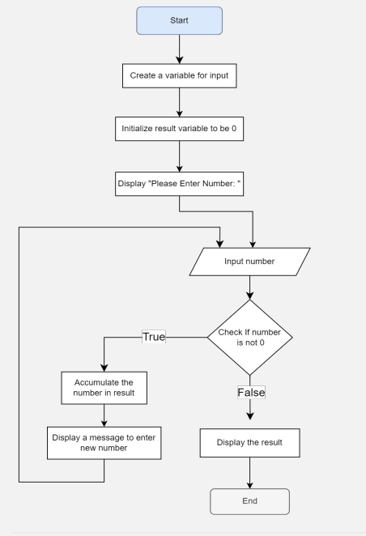

# C++ Task1

## Q1. Implement the code of the given Flowchart

## Q2. Convert a given integer number of seconds to hours, minutes, and seconds

## Q3. Convert a binary number to decimals and vice-versa

## Q4. City population growth

A city has a population of 162,100 with annual growth rate of 6.5%.
It is required to determine how many years would it take the population to surpass 1 million and print the population every year (annual population) till it exceeds that number.

## Q5. It's required to declare a structure container that carries information of Emplyees inside a company.
