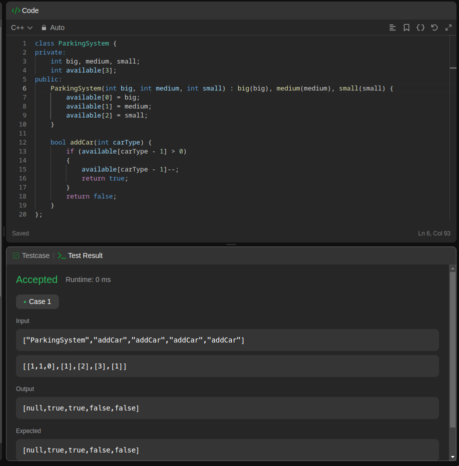
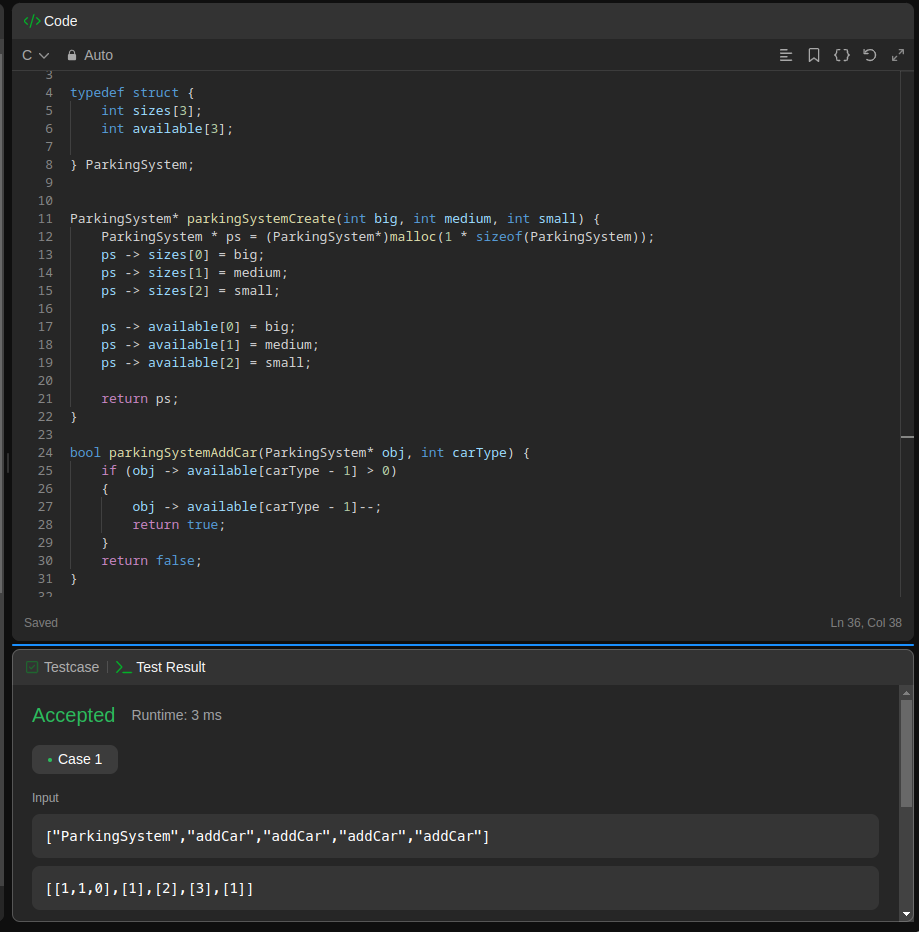
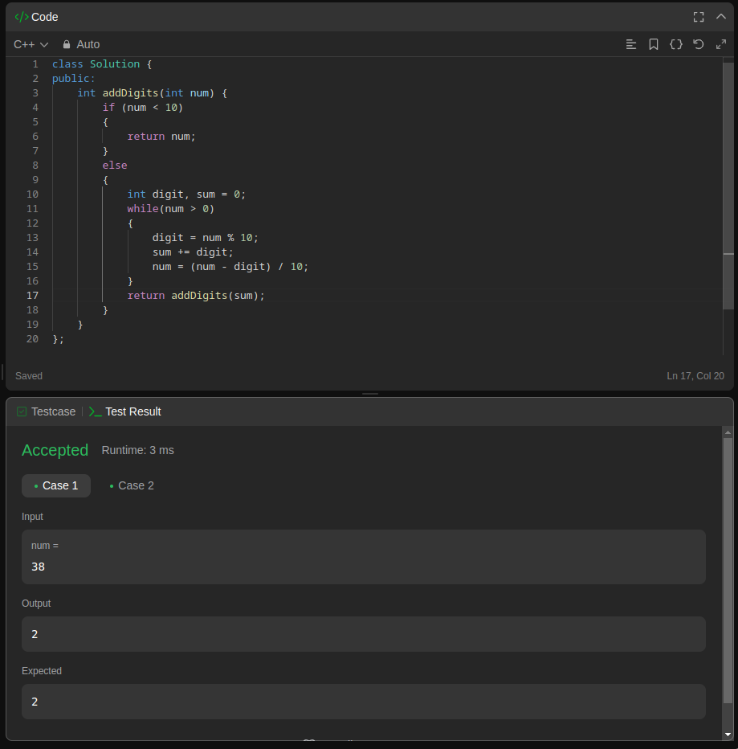

# C++ Task3

## Q1: Vertex Structure

It is required to generate and print 5 Verteces with random x and y.

## Q2: Vertex Class

It is required to make the same application as Q1 but with a class **Vertex**.

## Q3: Leetcode: Design Parking System in C & C++

It is required to design a Prking lot system that keeps track of available parking slots of each car size solt type.

### in C++

### in C

## Q4: Leetcode: Add Digits

It is required to add the digits of a number recursively until it becomes a single digits number.

