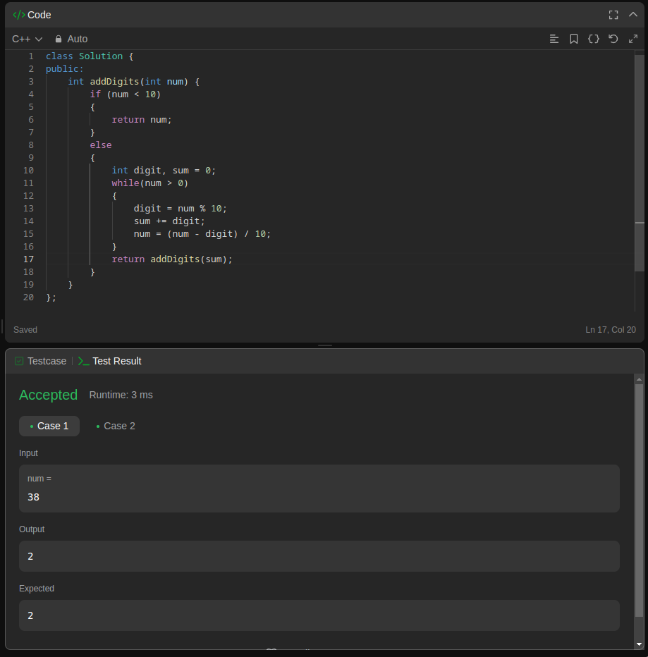
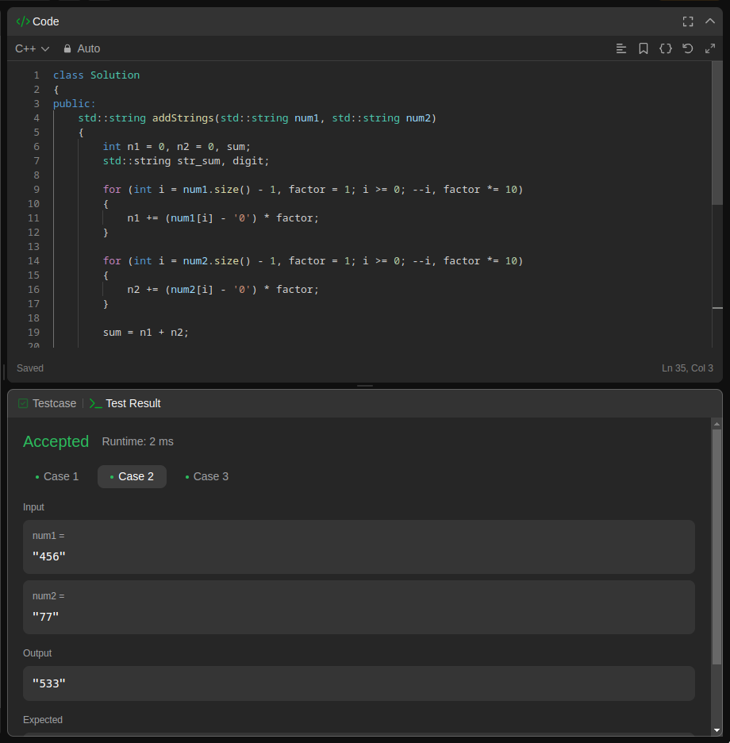
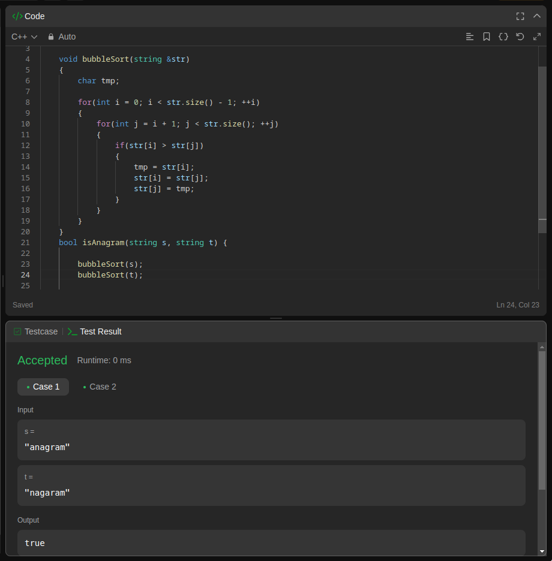
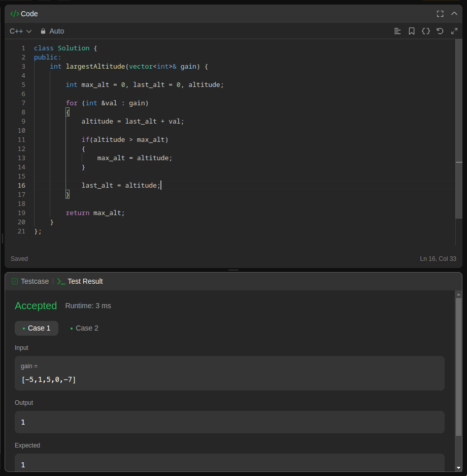

# C++ Task 5

## Q1: Time Class

It is required to create a **Time** class with member variables (hours, minutes, and seconds). The class allows displaying the object and adding two Time objects.

The Application adds two Time objects, storing the result in a third object, then displays this resulted Time.

### Example

When adding the two times (`5:45:30`) and (`11:20:50`) The resulted time will be calculated as follows:

| | hours | minutes | seconds |
| :----- | :-----: | :-----: | :-----: |
| | `+1` | `+1` | |
| | 05 | 45 | 30 |
| | 11 | 20 | 50 |
| Result | 17 | 06 | 20 |

---

## Q2: Leetcode: Add Digits

It is required to add the digits of a number recursively until it becomes a single digits number.

---

## Q3: Leetcode: Add Strings

It is required to add two numbers represented as strings and the result is a string without converting string numbers directly to integers.

---

## Q4: Leetcode: Valid Anagram

Given two strings, it is required to check if they are anagrams to each other. An Anagram is a word or phrase formed by rearranging the letters of a different word or phrase.

---

## Q5: Leetcode: Find the Highest Altitude

Given a vector of the number of gains in altitude a biker make in his route, it is required to get the max altitude.

