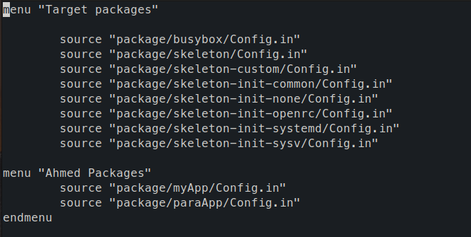

# Create Buildroot Package

1. Creating the new package folder under `./packages`

    >```shell
    >mkdir -p paraApp/src
    >cd paraApp/src
    >vim parapp.cpp
    >```

2. Write the `.cpp` source file
    >
    >```cpp
    >#include <iostream>
    >#include <thread>
    >
    >void th_function(int n)
    >{
    >   for (int i = 0; i < 10; ++i)
    >   {
    >       std::cout << "Hello from thread #" << n << std::endl;
    >   }
    >}
    >int main()
    >{
    >   // Creating threads
    >   std::thread th1(th_function, 1);
    >   std::thread th2(th_function, 2);
    >
    >   // join with the main thread
    >   th1.join();
    >   th2.join();
    >
    >   return 0;
    >}
    >```

3. Under the `src/` directory, create the makefile:

    >```shell
    >touch Makefile
    >```
    >
    >```makefile
    >.PHONY: clean
    >.PHONY: paraApp
    >
    >paraApp: paraapp.cpp
    >    $(CC) -g -Wall $(CFLAGS) $(LDFLAGS) $< -o $@
    >
    >clean:
    >    rm -f paraapp
    >
    >```

4. Create a package definition for this package in the this package directory which thell the buildroot how to build this new package and adds it to the `usr/bin`

    >```shell
    >cd ..
    >cd paraApp
    >touch pkg-parapp.mk
    >```
    >
    >```makefile
    >################################################################################
    >#
    ># paraApp package mk file
    ># Ahmed Essam
    >#
    >################################################################################
    >
    >PARAAPP_VERSION = 1.0
    >PARAAPP_SITE = package/paraApp/src
    >PARAAPP_SITE_METHOD = local# Other methods like git,wget,scp,file etc. are also available.
    >
    >define PARAAPP_BUILD_CMDS
    >    $(MAKE) CC="$(TARGET_CC)" LD="$(TARGET_LD)" -C $(@D)
    >endef
    >
    >define PARAAPP_INSTALL_TARGET_CMDS
    >    $(INSTALL) -D -m 0755 $(@D)/myApp  $(TARGET_DIR)/usr/bin
    >endef
    >
    >$(eval $(generic-package))
    >```

5. Add a `Config.in` file in the package directory to define the package display in the menuconfig

    >```shell
    >cd ..
    >vim Config.in
    >```

6. Add this package to a new menu in the menuconfig telling the buildroot where to fin it

    >

7. We can see the new package under the menu **Ahmed Packages**


