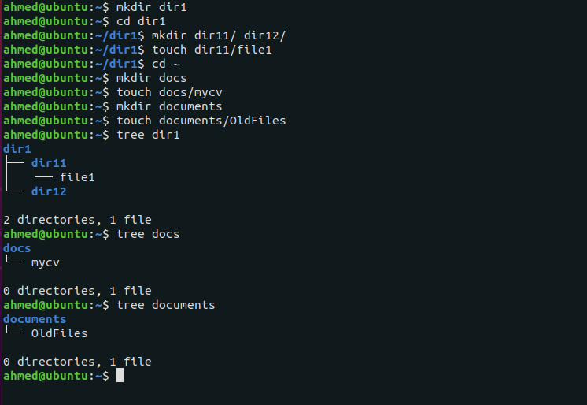
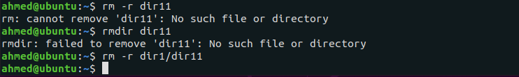
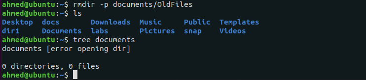
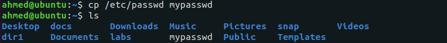
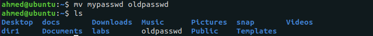
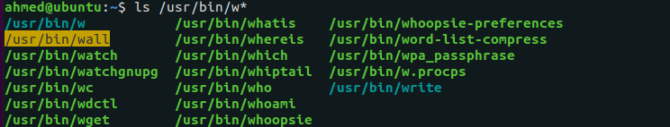
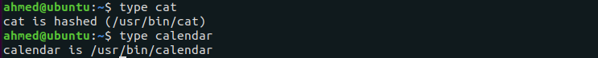
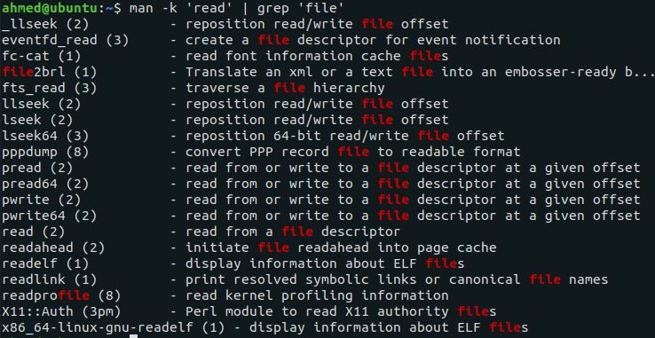
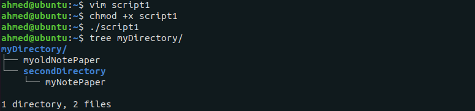

# Questions

## 1. List three Linux Distributions

* Ubuntu
* RedHat
* Fedora

## 2. From the slides what is the `man` command used for ?

The `man` command provides short refernce manuals for individual commands, API functions, concepts, configuartion file syntax, and file formats.

## 3. What is the difference between `rm` and `rmdir` using `man` command?

`rm` removes each specified file *-By default, it does not remove directories*. It can remove directories using `-r` and `-d`.

`rmdir` Remove the DIRECTORY(ies), if they are empty.

## 4. Create the following hierarchy under your home directory:-



### a. Remove **dir11 with rmdir** in one-step. What did you notice? And how did you overcome that?



**Failed** to remove `dir11` as it's not an empty directory.

**Overcome** by using the command `rm -r` to recursively remove the directory and its contents.

### b. Then remove **OldFiles** using `rmdir –p` command. State what happened to the hierarchy (**Note**: you are in your home directory)



The `rmdir -p` command removed the **OldFiles** directory and its parent **documents** which has become empty as well.

### c. The output of the command `pwd` was `/home/user`. Write the absolute and relative path for the file **mycv**

#### The absolute PATH

```shell
/home/user/docs/mycv
```

#### The relative PATH

```shell
docs/mycv
```

## 5. Copy the `/etc/passwd` file to your home directory making its name is mypasswd



## 6. Rename this new file to be oldpasswd



## 7. You are in `/usr/bin`, list four ways to go to your home directory

```shell
cd ~
cd
cd /home/user/
cd cd $HOME
```

## 8. List Linux commands in `/usr/bin` that start with letter **w**



## 9. What command **type** is used for? (from the slide)

Command `type` is used to find out whether a command is a Bash internal or an executable file on disk.

## 10. Show 2 types of command file in `/usr/bin` that start with letter **c**



`cat` command is external hashed inside /user/bin .
`calendar` is a Bash external command.

## 11. Using man command, find the command to read file. (**Note**: man take option)



## 12. What is the usage of **apropos** command?

`apropos` is equivalent to `man -k` which is used to search the man database commands with a specific keyword.

## Last Excersice

The output of the `script1.sh` bash script:


