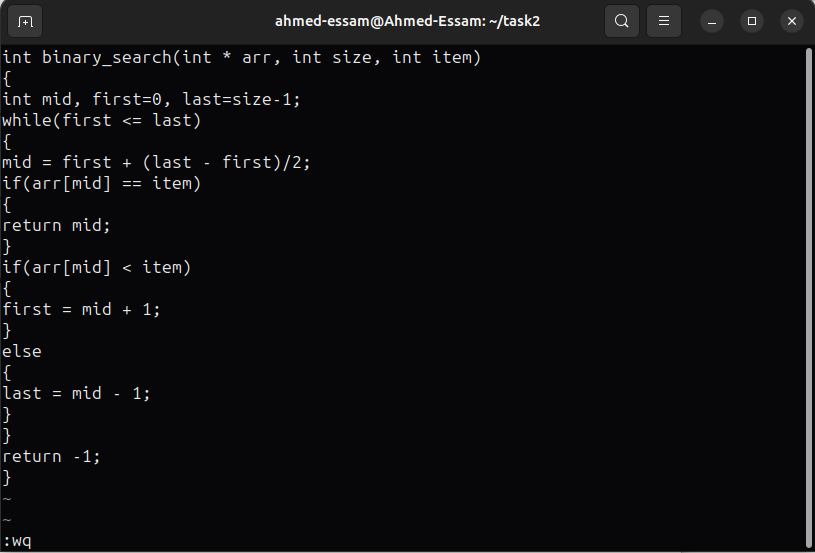
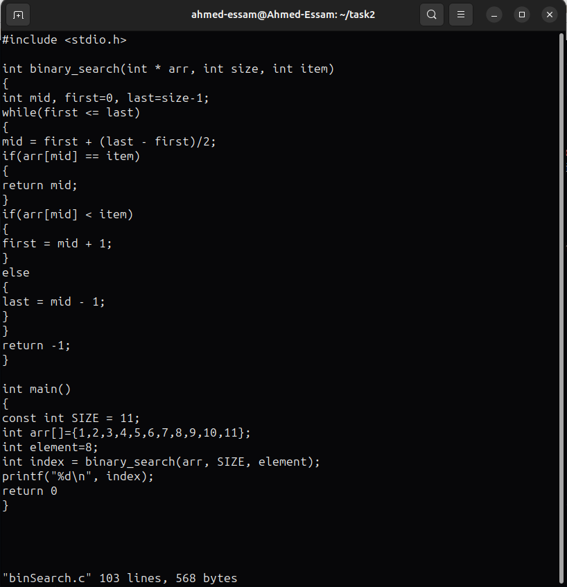
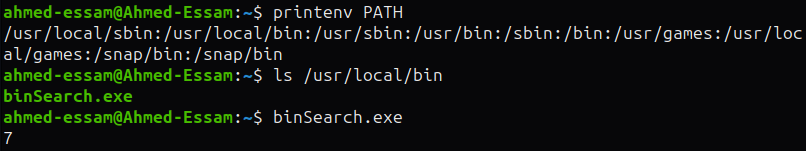
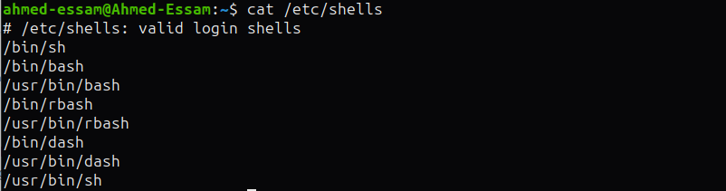
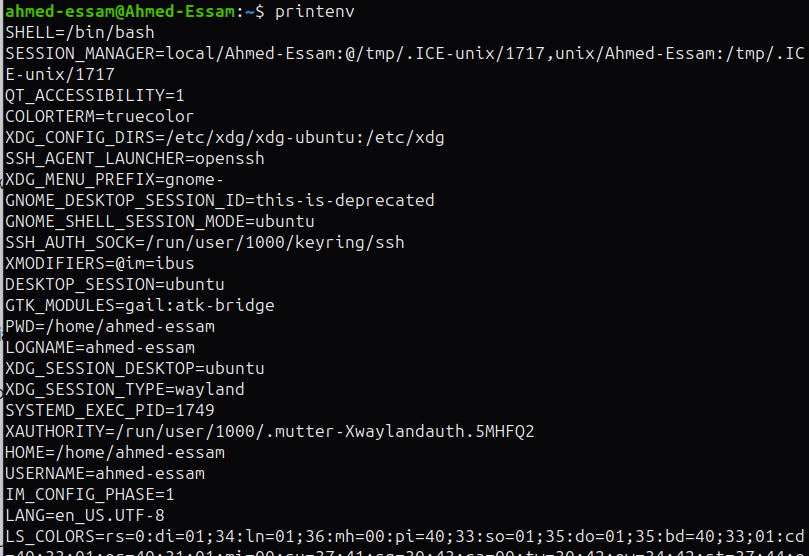

# Questions

## Q1. Using VI editor only

**1.** Implement the binary search algorithm inside the **binary_search** function.
Ensure that it returns the index of the searched element or `-1` if the element is
not present.

**2,3.** In the main function, declare an array and an element to search. Call the
binary search function with appropriate arguments and make sure to print the output of the search using **printf()**.

**4.** Compile and run your program to verify the correctness of your binary
search implementation.

---

## Q2

* Move the binary file output to the directory /usr/local/bin with sudo permissions.

* Afterward, attempt to execute the binary from any working directory and explain the
outcome.

* Provide a detailed explanation supported by evidence as to why the
binary can be executed from any location.

### Explanation

* Because the executable file is moved to the `/usr/local/bin/` directory which is one of directories included in the `PATH` environment variable. So, when executing this file from any directory, the bash locates it in this directory and executes it.

---

## na2na2a

### 1. List the available shells in your system

### 2. List the environment variables in your current shell

### 3. Display your current shell name

### 4. Execute the following command : `echo \` then press enter. What is the purpose of `\` ?

* `\` is a scape character that escapes the following line. Here it treats `$SHELL` as a normal string of characters. 
