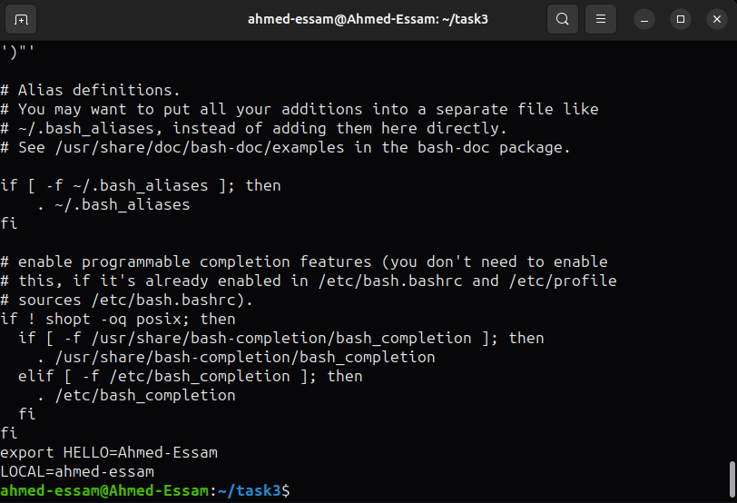

# Task3 Questions

## Section 1

Write a Bash script that checks IF the .bashrc file exists in the user's home
directory. If it does, append new environment variables to the file: one called
HELLO with the value of HOSTNAME, and another local variable called LOCAL
with the value of the whoami command. Additionally, the script should include a
command to open another terminal at the end.

The `.bashrc` file:

Describe what happens when the terminal is opened.

The new  terminal will print the environment variables defined in the `.bashrc` file edited from within the parent terminal.

* That is because `.bashrc` file is one for the user's terminals.
* So, editing it will affect the subsequent oppened terminals.
* These terminals will see global and local variables defined in the `.bashrc` file.

---

## Section 2

