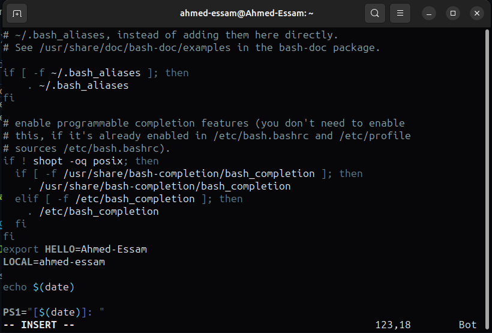

# Task3 Questions

## Section 1

Write a Bash script that checks IF the `.bashrc` file exists in the user's home
directory. If it does, append new environment variables to the file: one called
**HELLO** with the value of `HOSTNAME`, and another local variable called **LOCAL**
with the value of the `whoami` command. Additionally, the script should include a
command to open another terminal at the end.


The `.bashrc` file:


Describe what happens when the terminal is opened.


The new  terminal will print the environment variables defined in the `.bashrc` file edited from within the parent terminal.

* That is because `.bashrc` file is one for the user's terminals.
* So, editing it will affect the subsequent oppened terminals.
* These terminals will see global and local variables defined in the `.bashrc` file.

---

## Section 2

### 1. List the user commands and redirect the output to `/tmp/commands.list`


---

### 2. Edit in your profile to display date at login and change your prompt permanently

We add the following lines in the `~/.bashrc` file:

```bash
echo $(date)

PS1="[$(date)]: "
```



When opeining a new terminal:


---

### 3. What is the command to count the number of words in a file or the number of files in directory

To count the number of words in a file

```bash
wc -w filename
```


To count the number of files in a directory

```bash
ls -l | grep "^-" | wc -l
```

* `ls -l` to list the files in the long format
* `grep "^-"` to grep on the lines that starts with `-` (files)
* `wc -l` to count the yielded number of files


To count the number of user commands


---

### 4. What happens if you execute

#### a)

```bash
cat filename1 | cat filename2
```

* `cat filename1` will output the contents of the `filename1` to the input of the command `cat filename2`.
* But the command `cat filename2` does not require an input from its `stdin` file. It prints the contents of `filename2` (which is the `cat` file operand) into the terminal.


#### b)

```bash
ls | rm
```

* `rm` requires an operand.
* The `ls | rm` pipes the output of the `ls` command into the `rm` `stdin` file. But `rm` does not take its input from its `stdin` file. only from its file operand.


#### c)

```bash
ls /etc/passwd | wc –l
```

* `/etc/passwd` is a file. When running the `ls` command on it, it displays the file info in one line (name, ...) given different options.
* `wc -l` prints the number of lines. Here it's one.


---

### 5. Write a command to search for all files on the system that its name is “.profile”


---

### 6. List the inode numbers of `/`, `/etc`, `/etc/hosts`


---

### 7. Create a symbolic link of `/etc/passwd` in `/boot`


---

### 8. Create a hard link of `/etc/passwd` in `/boot`. Could you? Why?

No, we cannot create this hard link as these two directories are located in different file systems. And the hard link creates a new directory entry point to the same inode in the filesystem.

---

### 9. `echo \` will jump to the next line, and print `>`. Notice the prompt `>` what is that?

* The `echo` command still expects its input operand after jumping to a new line. So the prompt `>` means that the previous command is expecting an input across the next line.

#### How can you change it from `>` to `:`

* The `>` is called the secondary prompt `PS2`.
* To change it, we edit this environment variable in the `./bashrc` file


* So, when opeining a new terminal:


