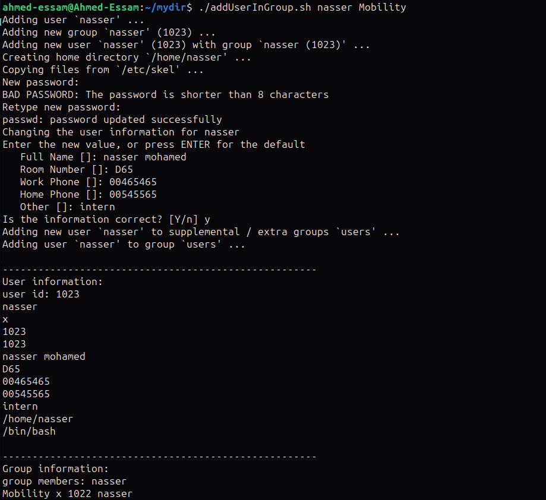
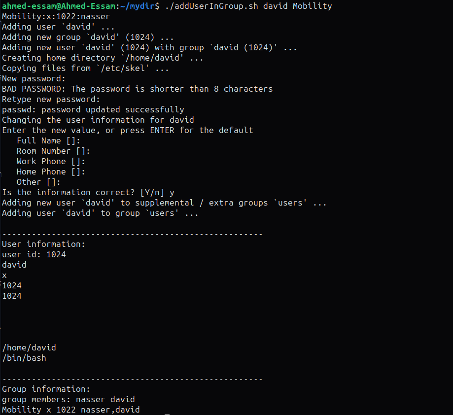
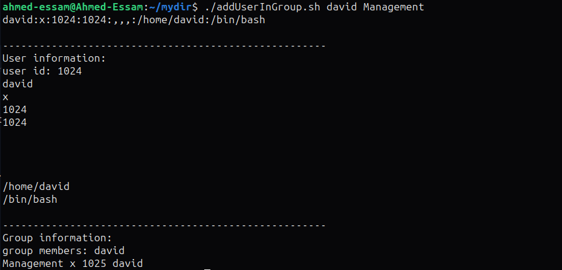
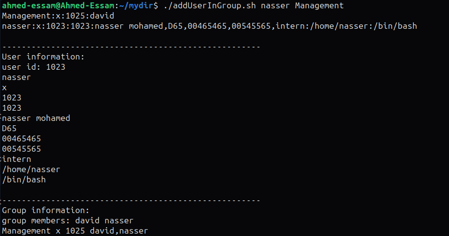
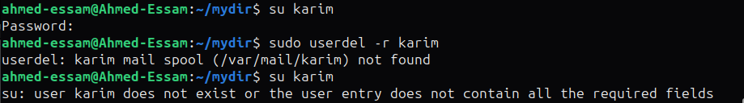
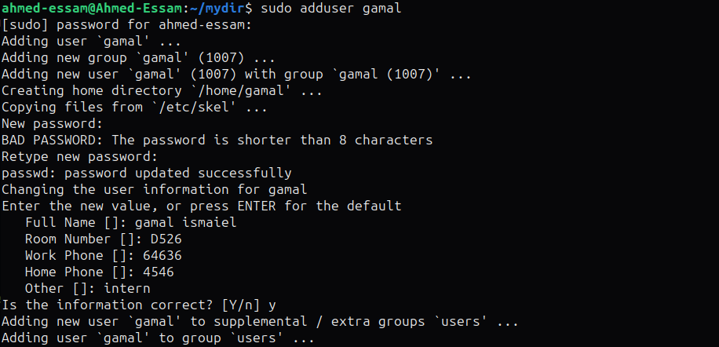

# Task4 Questions

## Section 1

It is required to add a user into a group after checking whether they exist or not and displaying the relative information for the user and group.

### running the bash script

The bash script file takes two arguments the user name and the group name as `./addUserInGroup userName groupName`:

```bash
./addUserInGroup nasser Mobility
```

* The script creates the group if not existed.
* Then, creates the user if not existed.
* Then, adds the user to the group if not added.
* And finally, displays user information and group information.

Here is the list of all the possible cases:

#### 1. Adding a new user to a new group



#### 2. Adding another user to an existing group using this script, it does not create the already existed group, only the new user. And displays the group info including all its users



#### 3. Passing an existing user but a new group, it only creates the group and adds this user in it



#### 4. Adding an existing user and existing group, yet this user does not belong to this group. It adds the user into the group and displays info



#### 5. The final case, where we pass an existing user who is in an existing group. It ony displays user and group info


---

## Section 2

### 1. Create a supplementary (Secondary) group called **pgroup** with group ID of **30000**


### 2. Lock any user created account so he can't log in


### 3. Delete user account



### 4. Delete group account


### 5. State the difference between adduser and useradd with example shown

| adduser | useradd |
| :------ | :------ |
| Creates a home directory | does not create a home directory (can be changed using -d)|
| 'bash' is the default shell | default shell is 'sh' (can be changed using -s) |
| Asks the user to enter user info (name, phone, ...etc) | does not ask for user additional info |
| Copies user configuration files from /etc/skel | Does not set up configuartion files |
| High level, Suitable for quick user configuration | low level. Suitable for automation purposes |

#### Example

##### Creating new user using `adduser`



* It creates a directory and shell is `bash`


##### Creating new user using `useradd`


* It does not cvreate a home directory and it sets default shell to `sh`
